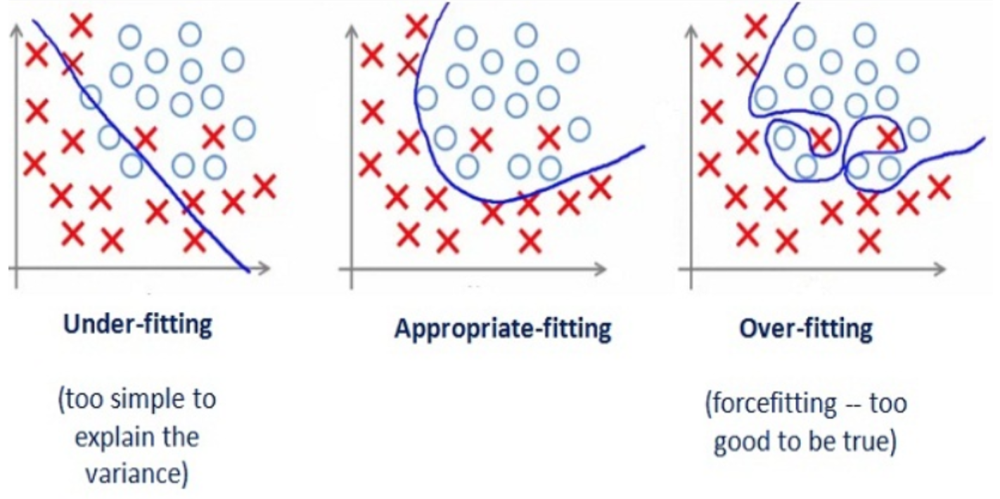

```{r setup, include=FALSE}
knitr::opts_chunk$set(echo = FALSE, message = FALSE)
```


## Supervised learning

**Supervised learning** consists of applying to unseen data a function obtained (learned) from a **training set** of labelled data to make a prediction.

Two types of supervised learning tasks:

* **Classification:** to identify the category to which an observation belongs. The outcome is the level of a categorical variable.
* **Regression** (numerical prediction): to predict the value of a numerical value for each observation. The outcome is a **numerical variable**.

## Spam detection

```{r, out.width='60%', fig.align='center'}
knitr::include_graphics('image/spamFilter.jpg')
```

A **classification** problem:

* **Outcome variable:** is the mail ham or spam?
* **Traning set:** a set of emails, with a label indicating if it is ham or spam.

## Housing prices

```{r, out.width='50%', fig.align='center'}
knitr::include_graphics('image/housing.png')
```

A **regression** problem:

* **Outcome variable:** what is the price of a house?
* **Training set:** a list of houses from which we know the price.

## How to train a model?

Our input is a data set with **features** (variables) for each observation and the value of the outcome variable.

Examples of features:

* Spam detection: email metadata, email content.
* Housing prices: location, area, number of rooms, apartment / house...
* Image recognition: RGB pixels of image.

## How to train a model?

We start training a model splitting the data into two sets:

* **Train set:** observations to define (train) the model.
* **Test set:** observations to examine model performance (replaces unseen data).

The test set must never be used to build the model, only for evaluation of model performance.

## The bias-variance tradeoff

When defining a supervised learning model we want to minimize bias and variance:

* **Bias error** comes from wrong assumptions in the learning algorithm. An algorithm with high bias is **underfitting** the data.
* **Variance error** comes from high sensitivity of the model to the values of the training set. An algorithm with high variance is **overfitting** the data.

## The bias-variance tradeoff

```{r, out.width='60%', fig.align='center'}

```

Source: <http://bit.ly/3rdcULH>

* **High bias:** equally bad values of performance in training and test sets.
* **High variance:** very good performance on train test, worse performance on test set.

We can't examine variance bias until we have chosen a model, so we better do not look for a too high performance in the trained model.

## Steps to build a supervised learning model

```{r, out.width='90%', fig.align='center'}
knitr::include_graphics('image/MLstages.png')
```

## Implementing supervised learning

```{r, out.width='90%', fig.align='center'}
knitr::include_graphics('image/tidyflow.png')
```

## Implementing supervised learning

```{r, out.width='90%', fig.align='center'}
knitr::include_graphics('image/tidymodels.png')
```

See a vignette at:

<https://rviews.rstudio.com/2019/06/19/a-gentle-intro-to-tidymodels/>
