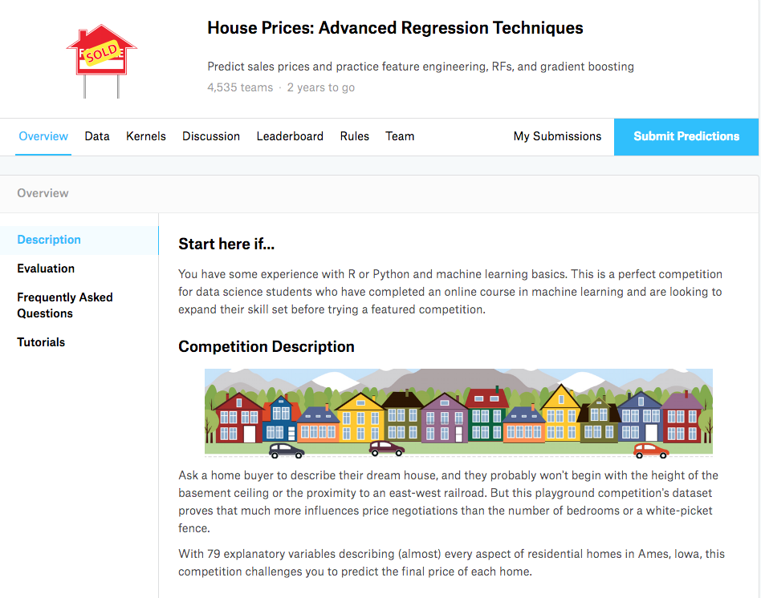
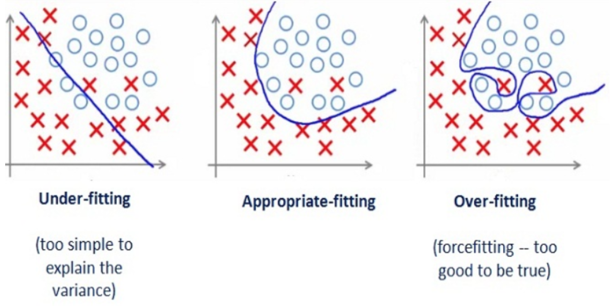
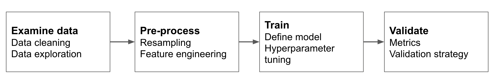

```{r setup, include=FALSE}
knitr::opts_chunk$set(echo = TRUE, message = FALSE)
library(kableExtra)
```

# Aprendizaje supervisado

## Aprendizaje supervisado

El **aprendizaje supervisado** consiste en aplicar a datos no vistos previamente una función obtenida (aprendida, entrenada) con un **conjunto de entrenamiento** de datos etiquetados para hacer una predicción.

Dos tareas de aprendizaje supervisado:

* **Clasificación:** identificar la clase a la que pertenece una observación. El resultado es la predicción del nivel de la **variable categórica** que identifica la clase, o la probabilidad de pertenecer a cada uno de los niveles.
* **Regresión** (predicción numérica): predecir el valor de un valor numérico para cada observación. El resultado es una **variable numérica**.

## Detección de spam

```{r, echo=FALSE, out.width='60%', fig.align='center'}

```

Un problema de **clasificación**:

* **Variable resultado**: ¿el correo es legítimo *(ham)* o *spam*?
* **Conjunto de entrenamiento**: un conjunto de emails, con una etiqueta que indica si son *ham* o *spam*.

## Precios de la vivienda

```{r, echo=FALSE, out.width='50%', fig.align='center'}

```

Un problema de **regresión**:

* **Variable resultado:** ¿qué precio tiene cada casa?
* **Conjunto de entrenamiento:** una lista de casas de las que conocemos el precio.

## ¿Cómo entrenar un modelo?

Nuestro input son unos datos con variables *(features)* para cada observación y el valor de la variable resultado.

Ejemplos de variables:

* Detección de spam: metadatos del email, contenido.
* Precios de la vivienda: localización, superficie, número de habitaciones, apartamento o casa...
* Reconocimiento de imagen: pixels de una imagen en RGB.

## ¿Cómo entrenar un modelo?

Como no tenemos datos no vistos, hemos de dividir nuestros datos en dos conjuntos:

* **Conjunto de entrenamiento *(train set)***: observaciones para definir (enseñar, entrenar) el modelo.
* **Conjunto de test *(test set)***: observaciones para examinar el desempeño del modelo (reemplazan a datos no vistos).

El conjunto de test **nunca debe ser usado para definir el modelo**, sólo para evaluar el desempeño del modelo final.

## El equilibrio entre sesgo y varianza

Al definir un modelo de aprendizaje supervisado queremos minimizar sesgo y varianza:

* El **error de sesgo *(bias error)*** proviene de asunciones incorrectas en el model: un modelo con sesgo alto está **subajustado *(underfit)*** a los datos.
* El **error de varianza *(variance error)*** proviene de que el modelo está **sobreajustado *(overfit)*** a los valores del conjunto de entrenamiento.

## El equilibrio entre sesgo y varianza

```{r, out.width='60%', fig.align='center', echo=FALSE}

```

Fuente: <http://bit.ly/3rdcULH>

* **Alto sesgo:** valores malos de desempeño en los conjuntos de entrenamiento y test.
* **Alta varianza:** desempeño muy bueno en el conjunto de entrenamiento, mal desempeño en el conjunto de test.

No podemos evaluar el error de varianza hasta haber escogido un modelo, así que no hay que aspirar a valores de ajuste muy elevados en el conjunto de entrenamiento.

## Etapas para elaborar un modelo de aprendizaje supervisado

```{r, out.width='90%', fig.align='center', echo=FALSE}

```

## Implementando aprendizaje supervisado

```{r, echo=FALSE, out.width='90%', fig.align='center'}
knitr::include_graphics('image/tidyflow.png')
```

## Implementando aprendizaje supervisado

```{r, echo=FALSE,out.width='90%', fig.align='center'}
knitr::include_graphics('image/tidymodels.png')
```

Ver ejemplo introductorio en:

<https://rviews.rstudio.com/2019/06/19/a-gentle-intro-to-tidymodels/>

# Clasificación con tidymodels

## Un flujo de trabajo mínimo con tidymodels

Veamos un flujo de trabajo mínimo con `tidymodels` para un problema de clasificación:

```{r}
library(tidymodels)
```

Consideremos el conjunto de datos `iris`:

```{r}
iris %>% glimpse()
```

## Definiendo conjuntos de entrenamiento y de test

Usamos la función `initial_split` de `rsample` para definir conjuntos de entrenamiento y de test:

```{r}
set.seed(1212)
iris_split <- initial_split(iris, prop = 0.6)
```

```{r}
training(iris_split) %>% glimpse() #train set
```

```{r}
testing(iris_split) %>% glimpse() # test set
```

## Pre-proceso de datos con recipes

Usamos el paquete `recipes` para pre-proceso de datos:

```{r}
iris_recipe <- training(iris_split) %>%
  recipe(Species ~.) %>%
  step_corr(all_predictors()) %>%
  step_center(all_predictors(), -all_outcomes()) %>%
  step_scale(all_predictors(), -all_outcomes()) %>%
  prep()
```

* `step_corr` elimina variables correladas con otras,
* `step_center` resta la media (obtenida del conjunto de entrenamiento),
* `step_scale` divide por la desviación estándar (obtenida del conjunto de entrenamiento).

## Pre-proceso de datos con recipes

```{r}
iris_recipe
```

La *receta* de pre-proceso ha eliminado `Petal.Length`.

## Construyendo un modelo

El paquete `parnsip` proporciona algoritmos para clasificación y regresión de diversas fuentes *(engines)*. Aquí construimos un modelo de *random forest* usando el paquete `ranger`:

```{r}
iris_ranger <- rand_forest(trees = 100, mode = "classification") %>%
  set_engine("ranger")
```

## Ajustando el modelo

Usamos el paquete `workflow` para integrar la receta y el modelo en un flujo de trabajo, y ajustamos el modelo con el conjunto de entrenamiento:

```{r}
iris_ranger_wf <- workflow() %>%
  add_recipe(iris_recipe) %>%
  add_model(iris_ranger) %>%
  fit(training(iris_split))
```

## Ajustando el modelo

```{r}
iris_ranger_wf
```

## Prediciendo el conjunto de entrenamiento

Con predict obtenemos la clase de cada miembro según el modelo: el resultado se encuentra en `.pred_class`. Podemos añadir el resultado como una columna de los datos originales.

```{r}
iris_pred_train <- iris_ranger_wf %>%
  predict(training(iris_split)) %>%
  bind_cols(training(iris_split))
iris_pred_train %>% glimpse()
```

## Desempeño del modelo: matriz de confusión

```{r}
iris_pred_train %>%
  conf_mat(truth = Species, estimate = .pred_class)
```


En la diagonal encontramos el número de observaciones clasificadas correctamente en cada clase. Para cada clase:

* la **precisión *(precision)*** es la fracción de clasificaciones que el modelo asigna a cada clase clasificadas correctamente.
* la **exhaustividad *(recall)*** es la fracción de observaciones que pertenecen a una clase clasificadas correctamente.

Si tenemos dos categorías etiquetadas como positivo y negativo:

* La **sensibilidad *(sensitivity)*** es el recall de la clase positiva.
* La **especificidad *(specificity)*** es el recall de la clase negativa.

La **exactitud *(accuracy)*** es la fracción de elementos clasificados correctamente.

## Relevancia de las medidas de clasificación

Consideremos los siguientes resultados de un hipotético sistema de detección de fraude en tarjetas de crédito:

```{r, echo=FALSE}
cm_table <- data.frame(positivo = c(100, 200), negativo = c(300, 3000))
rownames(cm_table) <- c("positivo", "negativo")
kbl(cm_table) %>%
    kable_styling(bootstrap_options = "striped", full_width = F, position = "center")
```

¿Cuál es la métrica relevante?

* *accuracy* = (100 + 3000) / (100 + 300 + 200 + 3000) = 0.86
* *sensitivity* = 100 / (100 + 200) = 0.33
* *specificity* = 3000 / (3000 + 300) = 0.91

¿Tenemos un buen modelo de clasificación?

## Desempeño del modelo: métricas

Usamos la función `metric_set` del paquete `yardstick` para seleccionar las métricas de desempeño que queremos ver.

```{r}
class_metrics <- metric_set(accuracy, precision, recall)
```

Obtenemos las métricas del modelo en `class_metrics` haciendo:

```{r}
iris_pred_train %>%
  class_metrics(truth = Species, estimate = .pred_class)
```

## Desempeño del modelo: matriz de confusión (test)

Podemos examinar el posible sobreajuste obteniendo la matriz de confusión para el conjunto de test:

```{r}
iris_ranger_wf %>%
  predict(testing(iris_split)) %>%
  bind_cols(testing(iris_split)) %>%
  conf_mat(truth = Species, estimate = .pred_class)
```

## Desempeño del modelo: métricas (test)

Métricas para el conjunto de test:

```{r}
iris_ranger_wf %>%
  predict(testing(iris_split)) %>%
  bind_cols(testing(iris_split)) %>%
  class_metrics(truth = Species, estimate = .pred_class)
```

Observamos también un buen desempeño en el conjunto de test.

Ver un workflow similar para clasificación binaria en: <https://bit.ly/3O5HIup>

# Regresión con tidymodels

## A flujo de trabajo mínimo con regresión

Consideremos los datos `BostonHousing` del paquete `mlbench`:

```{r}
library(mlbench)
data("BostonHousing")
BostonHousing %>% glimpse()
```

Queremos predecir los precios con la variable `medv`.

## Conjuntos de entrenamiento y de test

Usamos `initial_split` para definir los conjuntos de entrenamiento y test:

```{r}
set.seed(2021)
bh_split <- initial_split(BostonHousing, prob = 0.8)
```

## Pre-proceso de datos con recipes

```{r}
bh_recipe <- training(bh_split) %>%
  recipe(medv ~ .) %>%
  step_mutate(chas = as.numeric(chas)) %>%
  step_corr(all_predictors()) %>%
  step_nzv(all_predictors()) %>%
  prep()
```

* `step_mutate` cambia el tipo de `chas` de factor a numérico,
* `step_corr` busca variables correlacionadas,
* `step_nzv` busca variables de baja varianza.

## Pre-proceso de datos con recipes

```{r}
bh_recipe
```

## Construyendo un modelo

Entrenamos un modelo de regresión usando la función `lm`:

```{r}
bh_lm <- linear_reg("regression") %>%
  set_engine("lm")
```

## Ajustando el modelo

Definamos un flujo de trabajo para entrenar el modelo con el conjunto de entrenamiento:

```{r}
bh_lm_wf <- workflow() %>%
  add_recipe(bh_recipe) %>%
  add_model(bh_lm) %>%
  fit(training(bh_split))
```

## Ajustando el modelo

```{r}
bh_lm_wf
```

## Prediciendo el conjunto de entrenamiento

Para cada valor $y_i$ del conjunto de entrenamiento, obtenemos su predicción $\hat{y}_i$, y la añadimos a los datos:

```{r}
bh_lm_wf_pred <- bh_lm_wf %>%
  predict(training(bh_split)) %>%
  bind_cols(training(bh_split))
```

Tenemos el valor real y el previsto en el mismo data frame:

```{r}
bh_lm_wf_pred %>%
  select(medv, .pred) %>%
  glimpse()
```

## Desempeño del modelo en regresión

Necesitamos parámetros para evaluar cuan cerca están las predicciones $\hat{y}_i$ de los valores $y_i$ para un conjunto con $n$ observaciones.

* **Raíz del error cuadrático medio** `rmse`:

\[ \sqrt{\frac{\sum \left( \hat{y}_i - y_i \right)^2}{n}} \]

* **Error absoluto medio** `mae`:

\[  \frac{\sum \vert \hat{y}_i - y_i \vert}{n} \]

* **R cuadrado** $R^2$ `rsq` es el cuadrado de la correlación entre $\mathbf{y}$ y $\mathbf{\hat{y}}$.

## Desempeño del modelo

Conjunto de entrenamiento:

```{r}
bh_lm_wf_pred %>%
  metrics(truth = medv, estimate = .pred)
```

Conjunto de test:

```{r}
bh_lm_wf %>%
  predict(testing(bh_split)) %>%
  bind_cols(testing(bh_split)) %>%
  metrics(truth = medv, estimate = .pred)
```

# Evaluando modelos alternativos

## Como evaluar modelos alternativos

Normalmente no tenemos un solo modelo, sino que tenemos que evaluar diferentes alternativas:

* Varios modelos,
* Varios parámetros de ajuste de un modelo,
* Una combinación de los dos.

No podemos usar para esto el cojunto de test, puesto que podríamos sobreajustar el modelo al conjunto de test.

## Remuestreo (resampling)

```{r, out.width='80%', fig.align='center', echo=FALSE}
knitr::include_graphics('image/resampling.svg')
```

Fuente: <https://bookdown.org/max/FES/>

## Validación cruzada

Dividimos los datos de entrenamiento entre *k* particiones *(folds)* y hacemos *k* remuestreos:

* El conjunto de validación es cada una de las *k* particiones, y el conjunto de entrenamiento las otras *k-1* particiones,
* evaluamos el desempeño en cada conjunto de validación,
* promediamos el desempeño para los *k* remuestreos.

Una vez seleccionado el modelos, lo entrenamos usando todo el conjunto de entrenamiento.

Usamos

* `vfold_cv` de `rsample` para definir las particiones,
* `fit_resamples` y `collect_metrics` de `tune` para evaluar los modelos.

## Un ejemplo de validación cruzada

Definamos un flujo de trabajo con `bh_recipe` y `bh_lm`:

```{r}
bh_wf <- workflow() %>%
  add_recipe(bh_recipe) %>%
  add_model(bh_lm)
```

definimos una validación cruzada con cinco particiones en el conjunto de entrenamiento:

```{r}
set.seed(1212)
bh_folds <- vfold_cv(training(bh_split), v = 5)
```

y realizamos la validación cruzada:

```{r}
fit_resamples(bh_wf, bh_folds) %>%
  collect_metrics()
```

Podemos repetir el proceso con otro modelo (por ejemplo, regresión regularizada) y comparar los resultados.

