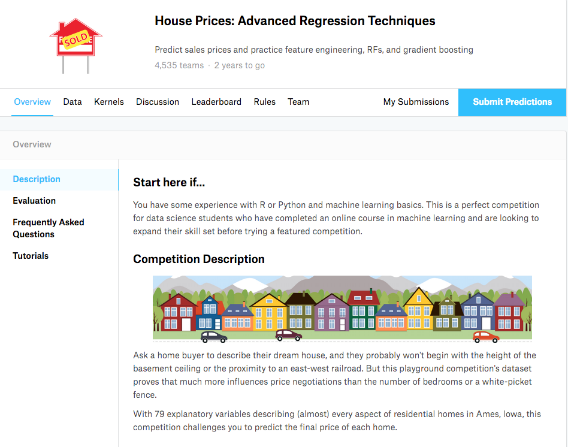
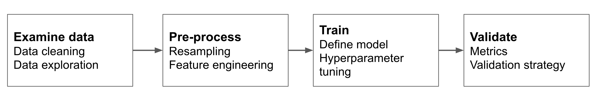

```{r setup, include=FALSE}
knitr::opts_chunk$set(echo = TRUE, message = FALSE)
library(kableExtra)
```

# Supervised learning

## Supervised learning

**Supervised learning** consists of applying to unseen data a function obtained (learned, trained) from a **training set** of labelled data to make a prediction.

Two supervised learning tasks:

* **Classification:** to identify the class to which an observation belongs. The outcome is the prediction of the level of a **categorical variable**, or the probability to having each of the levels.
* **Regression** (numerical prediction): to predict the value of a numerical value for each observation. The outcome is a **numerical variable**.

## Spam detection

```{r, echo=FALSE, out.width='60%', fig.align='center'}
knitr::include_graphics('image/spamFilter.jpg')
```

A **classification** problem:

* **Outcome variable:** is the mail ham or spam?
* **Traning set:** a set of emails, with a label indicating if it is ham or spam.

## Housing prices

```{r, echo=FALSE, out.width='50%', fig.align='center'}

```

A **regression** problem:

* **Outcome variable:** what is the price of a house?
* **Training set:** a list of houses from which we know the price.

## How to train a model?

Our input is a data set with **features** (variables) for each observation and the value of the outcome variable.

Examples of features:

* Spam detection: email metadata, email content.
* Housing prices: location, area, number of rooms, apartment / house...
* Image recognition: RGB pixels of image.

## How to train a model?

We don't have unseen data, so we need to split data into two sets:

* **Train set:** observations to define (learn, train) the model.
* **Test set:** observations to examine model performance (replaces unseen data).

The test set must **never be used to build the model**, only for evaluation of performance of the final model.

## The bias-variance tradeoff

When defining a supervised learning model we want to minimize bias and variance:

* **Bias error** comes from wrong assumptions in the learning algorithm: an algorithm with high bias is **underfitting** the data.
* **Variance error** comes from high sensitivity of the model to the values of the training set: an algorithm with high variance is **overfitting** the data.

## The bias-variance tradeoff

```{r, out.width='60%', fig.align='center', echo=FALSE}
knitr::include_graphics('image/biasvariance.png')
```

Source: <http://bit.ly/3rdcULH>

* **High bias:** equally bad values of performance in training and test sets.
* **High variance:** very good performance on train test, worse performance on test set.

We can't examine variance bias until we have chosen a model, so we better do not look for a too high performance in the trained model.

## Steps to build a supervised learning model

```{r, out.width='90%', fig.align='center', echo=FALSE}

```

## Implementing supervised learning

```{r, echo=FALSE, out.width='90%', fig.align='center'}
knitr::include_graphics('image/tidyflow.png')
```

## Implementing supervised learning

```{r, echo=FALSE,out.width='90%', fig.align='center'}
knitr::include_graphics('image/tidymodels.png')
```

See vignette at:

<https://rviews.rstudio.com/2019/06/19/a-gentle-intro-to-tidymodels/>

# Classification with tidymodels

## A minimal classification workflow

Let's see a minimal `tidymodels` workflow for a classification problem:

```{r}
library(tidymodels)
```


Let's consider the `iris` dataset:

```{r}
iris %>% glimpse()
```

## Split into train and test sets

We use the `initial_split` function of `rsample` to define train and test sets:

```{r}
set.seed(1212)
iris_split <- initial_split(iris, prop = 0.6)
```

```{r}
training(iris_split) %>% glimpse() #train set
```

```{r}
testing(iris_split) %>% glimpse() # test set
```

## Pre-processing with a recipe

We use the `recipes` package for data pre-processing:

```{r}
iris_recipe <- training(iris_split) %>%
  recipe(Species ~.) %>%
  step_corr(all_predictors()) %>%
  step_center(all_predictors(), -all_outcomes()) %>%
  step_scale(all_predictors(), -all_outcomes()) %>%
  prep()
```

* `step_corr` removes highly correlated variables,
* `step_center` substracts the mean (obtained from the train set),
* `step_scale` divides by standard deviation (obtained from the train set).

## Pre-processing with a recipe

```{r}
iris_recipe
```

The recipe has removed the `Petal.Length` variable.

## Building a model

The `parnsip` package provides algorithms for classification and regression from several sources (`engines` in parsnip parlance). Here we train a random forest model using the `ranger` package.

```{r}
iris_ranger <- rand_forest(trees = 100, mode = "classification") %>%
  set_engine("ranger")
```

## Fitting the model

We use the `workflow` package to integrate the recipe and the model in a workflow, and we fit the model using the train set:

```{r}
iris_ranger_wf <- workflow() %>%
  add_recipe(iris_recipe) %>%
  add_model(iris_ranger) %>%
  fit(training(iris_split))
```

## Fitting the model

```{r}
iris_ranger_wf
```

## Predicting the train set

Let's `predict` the category of each member of the train set: the result is stored in `.pred_class`. We can bind the prediction to the original dataset.

```{r}
iris_pred_train <- iris_ranger_wf %>%
  predict(training(iris_split)) %>%
  bind_cols(training(iris_split))
iris_pred_train %>% glimpse()
```

## Model performance: confusion matrix

```{r}
iris_pred_train %>%
  conf_mat(truth = Species, estimate = .pred_class)
```

Values on the diagonal are observations classified correctly. For each class:

* **precision** is the fraction of observations predicted as class members correctly classified.
* **recall** is the fraction of observations that belong to the class that are correctly classified.

The **accuracy** is the fraction of elements correctly classified.

In a classification problem with two categories labelled as positive and negative:

* **sensitivity** is the recall of the positive class.
* **specificity** is the recall of the negative class.

## Relevance of classification measures

Let's consider the following results from an hypothetical credit card fraud detection system:

```{r, echo=FALSE}
cm_table <- data.frame(positive = c(100, 200), negative = c(300, 3000))
rownames(cm_table) <- c("positive", "negative")
kbl(cm_table) %>%
    kable_styling(bootstrap_options = "striped", full_width = F, position = "center")
```

Which is the relevant metric?

* accuracy = (100 + 3000) / (100 + 300 + 200 + 3000) = 0.86
* sensitivity = 100 / (100 + 200) = 0.33
* specificity = 3000 / (3000 + 300) = 0.91

Is this a good classification?

## Model performance: metrics

We use `metric_set` from the `yardstick` package to select the performance metrics we want to see.

```{r}
class_metrics <- metric_set(accuracy, precision, recall)
```

We obtain the metrics in `class_metrics` of the model doing:

```{r}
iris_pred_train %>%
  class_metrics(truth = Species, estimate = .pred_class)
```

## Probabilistic prediction

Usually classification models do not predict a class, but the probabilities to belong to each class. We can obtain them doing:

```{r}
iris_prob_train <- iris_ranger_wf %>%
  predict(training(iris_split), type = "prob") %>%
  bind_cols(training(iris_split))
iris_prob_train %>% glimpse()
```

## ROC curve

The ROC curve plots values of **false positive rate** on the x axis and **true positive rate** on the y axis for different thresholds of probability for each class.

Good classifications give values of area under the ROC curve (AUC) close to one.

```{r}
iris_prob_train %>%
  roc_auc(Species, .pred_setosa:.pred_virginica)
```

Lear more at: <https://bit.ly/3O6n7pY>

## ROC curve

```{r, fig.align='center', out.width='80%'}
iris_prob_train %>%
  roc_curve(Species, .pred_setosa:.pred_virginica) %>%
  autoplot()
```

## Model performance: confusion matrix (test set)

We can check for overfitting calculating performance metrics for the test set:

```{r}
iris_ranger_wf %>%
  predict(testing(iris_split)) %>%
  bind_cols(testing(iris_split)) %>%
  conf_mat(truth = Species, estimate = .pred_class)
```

## Model performance: metrics (test set)

```{r}
iris_ranger_wf %>%
  predict(testing(iris_split)) %>%
  bind_cols(testing(iris_split)) %>%
  class_metrics(truth = Species, estimate = .pred_class)
```

We observe a very good performance also on the test set.

See a binary classification workflow at: <https://bit.ly/3O5HIup>

# Regression with tidymodels

## A minimal regression workflow

Let's consider the `BostonHousing` dataset from the `mlbench` package:

```{r}
library(mlbench)
data("BostonHousing")
BostonHousing %>% glimpse()
```

Our job is to predict the housing prices of the `medv` variable.

## Split into train and test sets

We use `initial_split` to build train and test sets:

```{r}
set.seed(2021)
bh_split <- initial_split(BostonHousing, prob = 0.8)
```

## Pre-processing with a recipe

```{r}
bh_recipe <- training(bh_split) %>%
  recipe(medv ~ .) %>%
  step_mutate(chas = as.numeric(chas)) %>%
  step_corr(all_predictors()) %>%
  step_nzv(all_predictors()) %>%
  prep()
```

* `step_mutate` changes the type of `chas` from factor to numeric,
* `step_corr` looks for correlated features,
* `step_nzv` looks for variables of low variance.

## Pre-processing with a recipe

```{r}
bh_recipe
```

## Building a model

We train a straight regression model using the `lm` function from R base:

```{r}
bh_lm <- linear_reg("regression") %>%
  set_engine("lm")
```

## Fitting the model

Let's define a workflow to train the regression model with the training set:

```{r}
bh_lm_wf <- workflow() %>%
  add_recipe(bh_recipe) %>%
  add_model(bh_lm) %>%
  fit(training(bh_split))
```

## Fitting the model

```{r}
bh_lm_wf
```

## Predicting the train set

For each value $y_i$ of the train set, we obtain its prediction $\hat{y}_i$, and add it to the data:

```{r}
bh_lm_wf_pred <- bh_lm_wf %>%
  predict(training(bh_split)) %>%
  bind_cols(training(bh_split))
```

We have the real value and the prediction together in the same data frame:

```{r}
bh_lm_wf_pred %>%
  select(medv, .pred) %>%
  glimpse()
```

## Model performance in regression

We need parameters to assess how close predictions $\hat{y}_i$ are close to real values $y_i$ for a set of $n$ observations.

* **Root mean square error** `rmse`:

\[ \sqrt{\frac{\sum \left( \hat{y}_i - y_i \right)^2}{n}} \]

* **Mean absolute error** `mae`:

\[  \frac{\sum \vert \hat{y}_i - y_i \vert}{n} \]

* **R squared** $R^2$ `rsq` is the squared correlation between $\mathbf{y}$ and $\mathbf{\hat{y}}$.

## Model performance

Train set:

```{r}
bh_lm_wf_pred %>%
  metrics(truth = medv, estimate = .pred)
```

Test set:

```{r}
bh_lm_wf %>%
  predict(testing(bh_split)) %>%
  bind_cols(testing(bh_split)) %>%
  metrics(truth = medv, estimate = .pred)
```

# Evaluating alternative models

## How to evaluate alternative models

Usually we don't have a single model, but we need to evaluate several alternatives:

* Several models,
* Several tuning parameters of a model,
* A combination of both.

We can't use the test set for that, but we don't want to select a model overfitting the train test.

## Resampling

```{r, out.width='80%', fig.align='center', echo=FALSE}
knitr::include_graphics('image/resampling.svg')
```

Source: <https://bookdown.org/max/FES/>

## Cross validation

We split training data into *k* folds and perform *k* resamples.

* Use as validation set is each of the *k* folds, and as training set the other *k-1* folds,
* evaluate performance on each validation set,
* and average performance across *k* resamples.

Once chosen the model, we train it using the whole training set.

We use:

* `vfold_cv` from the `rsample` package to define folds,
* `fit_resamples` and `collect_metrics` from the `tune` package to evaluate models.

## An example of cross validation

Let's define a workflow with the `bh_recipe` and `bh_lm` we have previously defined:

```{r}
bh_wf <- workflow() %>%
  add_recipe(bh_recipe) %>%
  add_model(bh_lm)
```

and define a cross-validation with five folds on the training set:

```{r}
set.seed(1212)
bh_folds <- vfold_cv(training(bh_split), v = 5)
```

and perform cross validation:

```{r}
fit_resamples(bh_wf, bh_folds) %>%
  collect_metrics()
```

We would do that with any other alternative model (e.g., regularized regression).

# Tuning models

## Hyperparameter tuning

The outcome of some models depends on the value of some variables set to obtain parameters, we call these variables **hyperparameters**.

In random forests:

* `mtry`: The number of predictors that will be randomly sampled at each split when creating the tree models.
* `trees`: The number of trees contained in the ensemble.

<https://parsnip.tidymodels.org/reference/rand_forest.html>

## Elements for hyperparameter tuning

We use `expand.grid` to define a **tuning grid**:

```{r}
rf_grid <- expand.grid(mtry = c(1, 5, 10), trees = c(5, 10, 15))
rf_grid
```

## Elements for hyperparameter tuning

We define the **model** specifying that we want to `tune()` hyperparameters `mtry` and `trees`:

```{r}
bh_rf <- rand_forest(mode = "regression", mtry = tune(), trees = tune()) %>%
  set_engine("ranger")
```

Other elements:

* the **preprocessing** recipe `bh_recipe`,
* the **cross-validation** folders `bh_folds`.

We will train the model 5 times for each of the 9 values of the tuning grid.

## Performing hyperparameter tuning

Let's tune the model (this takes time):

```{r, cache=FALSE}
rf_tune <- tune_grid(object = bh_rf, 
                     preprocessor = bh_recipe, 
                     resamples = bh_folds, 
                     grid = rf_grid, 
                     metrics = metric_set(rmse, mae))
```

Results:

```{r}
show_best(rf_tune, metric = "mae")
```

# Classification with imbalanced data

## Imbalanced data

It is usual that in classification problems we have an unequal distribution of observations across classes, usually with less observations in the positive class. These are **imbalanced datasets**.

Imbalanced data problems are frequent in business analytics:

* credit card fraud
* bankruptcy prevention
* ...

## An imbalanced dataset

Let's pick an artificial dataset with imbalanced data:

```{r}
imbal_data <- 
  readr::read_csv("https://bit.ly/imbal_data") %>% 
  mutate(Class = factor(Class))
```

```{r, echo=FALSE}
imbal_data %>%
  ggplot(aes(Class)) +
  geom_bar(stat = "count")
```

## A training workflow

Let's split into train and test, maintaining the same proportion of positives in train and test sets with `strata = "Class"`:

```{r}
set.seed(1122)
imbal_split <- initial_split(imbal_data, prop = 0.8, strata = "Class")
```

We will use a quadratic **discriminant analysis model (QDA)** to train the data:

```{r}
library(discrim)
qda_mod <- discrim_regularized(frac_common_cov = 0, frac_identity = 0) %>%  
  set_engine("klaR")
```

And build the workflow to fit the model with the train set:

```{r}
qda_wflw <- 
  workflow() %>% 
  add_model(qda_mod) %>% 
  add_formula(Class ~ .) %>%
  fit(training(imbal_split))
```

## Evaluating with cross validation

Let's use cross validation to evaluate the classifier with five folds and five repeats:

```{r}
set.seed(5732)
cv_folds <- vfold_cv(training(imbal_split), 
                     strata = "Class", 
                     v=5, repeats = 5)
```

Let's define a set of classification metrics:

```{r}
cls_metrics <- metric_set(accuracy, sens, spec)
```

## What are the results?

```{r, cache=FALSE}
set.seed(2180)
qda_res <- fit_resamples(
  qda_wflw, 
  resamples = cv_folds, 
  metrics = cls_metrics)
```

```{r}
collect_metrics(qda_res)
```

## Imbalanced data in classification

Applying the usual workflow to imbalanced data in classification problems usually obtain:

* high accuracy and specificity.
* low sensitivity.

These are not good news (think of a credit card fraud detection project)...

## Subsampling for imbalanced data

We can test the possibility of **subsampling** if we obtain poor performance in imbalanced classification problems:

* **Undersampling** or **downsampling** means reducing the number of observations of the majority class to obtain a balanced dataset.
* **Oversampling** or **upsampling** consists of creating additional observations of the minority class to obtain a balanced dataset.

* <https://www.tidymodels.org/learn/models/sub-sampling/>

## Subsampling in tidymodels

Subsampling in `tidymodels` is done with the `themis` package. It extends the functionality of `recipes` adding steps to subsample imbalanced data

The default recipes for subsampling are:

* `step_subsample` for undersampling,
* `step_upsample` for oversampling.

For more recipes, see:

<https://github.com/tidymodels/themis>

If `themis` recipes are used with the default mode `skip = TRUE`:

* the model is fit with the subsampled dataset,
* and predictions are computed with the original dataset.

## A workflow with subsampling: evaluating the model

Let's train a model for `imbal_data` with oversampling using the ***ROSE** algorithm (Randomly Over Sampling Examples). Let's use the `step_rose` recipe from the `themis` package:

```{r}
library(themis)
imbal_rec <- 
  recipe(Class ~ ., data = imbal_data) %>%
  step_rose(Class)
```

... add the recipe to the `qda_rose_wflw` workflow:

```{r}
qda_rose_wflw <- 
  workflow() %>% 
  add_model(qda_mod) %>% 
  add_recipe(imbal_rec)
```

... and assess the model using cross validation:

```{r, cache=FALSE}
set.seed(2180)
qda_rose_res <- fit_resamples(
  qda_rose_wflw, 
  resamples = cv_folds, 
  metrics = cls_metrics)
```

## Results of non-subsampled and subsampled models

Let's compare the results of the non-subsampled model:

```{r}
collect_metrics(qda_res)
```

... with the subsampled model:

```{r}
collect_metrics(qda_rose_res)
```

## A workflow with subsampling: predicting train and test

Let's predict train and test sets with the subsampled model, and assess model performance in both sets:

```{r}
fit_rose <- qda_rose_wflw %>%
  fit(training(imbal_split))
```

```{r}
predict_rose_train <- fit_rose %>%
    predict(training(imbal_split)) %>%
    bind_cols(training(imbal_split))
```

```{r}
predict_rose_test <- fit_rose %>%
    predict(testing(imbal_split)) %>%
    bind_cols(testing(imbal_split))
```

## A workflow with subsampling: confusion matrices

```{r}
predict_rose_train %>%
    conf_mat(truth = Class, estimate = .pred_class)
```

```{r}
predict_rose_test %>%
    conf_mat(truth = Class, estimate = .pred_class)
```

## A workflow with subsampling: performance metrics

```{r}
cls_metrics <- metric_set(accuracy, sens, spec)
```

```{r}
predict_rose_train %>%
  cls_metrics(truth = Class, estimate = .pred_class)
```

```{r}
predict_rose_test %>%
  cls_metrics(truth = Class, estimate = .pred_class)
```

## Results of subsampling

When we apply subsampling to imbalanced data we can be able to obtain:

* lower values of accuracy and specificity,
* but better values of sensitivity.

This can be a good tradeoff if we are concerned with detecting positives as accurately as possible. We must take into account that:

* Some classification techniques may work better with subsampling than others,
* Some subsampling recipes like `step_rose` with with numeric features only.
